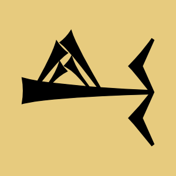

 

# Ur Coach

UrCoach is an iOS app for the [Royal Game of Ur](https://en.wikipedia.org/wiki/Royal_Game_of_Ur). The app lets you play against the computer or another human player (by pass-and-play). The computer implements a mathematically optimal strategy. You can learn a lot about the game by watching how the computer AI plays. When playing against the computer, you also have the option of displaying a detailed analysis of your available moves.

### Installation

The app can be downloaded for free from the Apple [App Store](https://apps.apple.com/us/app/queah/id6670455978/). There are no in-app purchases or ads.

### License

The source code for this app has been released under the [MIT License](LICENSE).

### Copyright

© 2024 Stephen E. Bensley

## Building from Source

The app was developed with [Xcode](https://developer.apple.com/xcode/), which is freely available from Apple. After installing Xcode and cloning the repo, open the Xcode [project](UrCoach.xcodeproj) at the root of the repo.

### Dependencies

The app depends on two Swift Packages (both developed by me): [UtiliKit](https://github.com/stephenbensley/UtiliKit) and [CheckersKit](https://github.com/stephenbensley/CheckersKit). These will be resolved automatically when you open the project.
